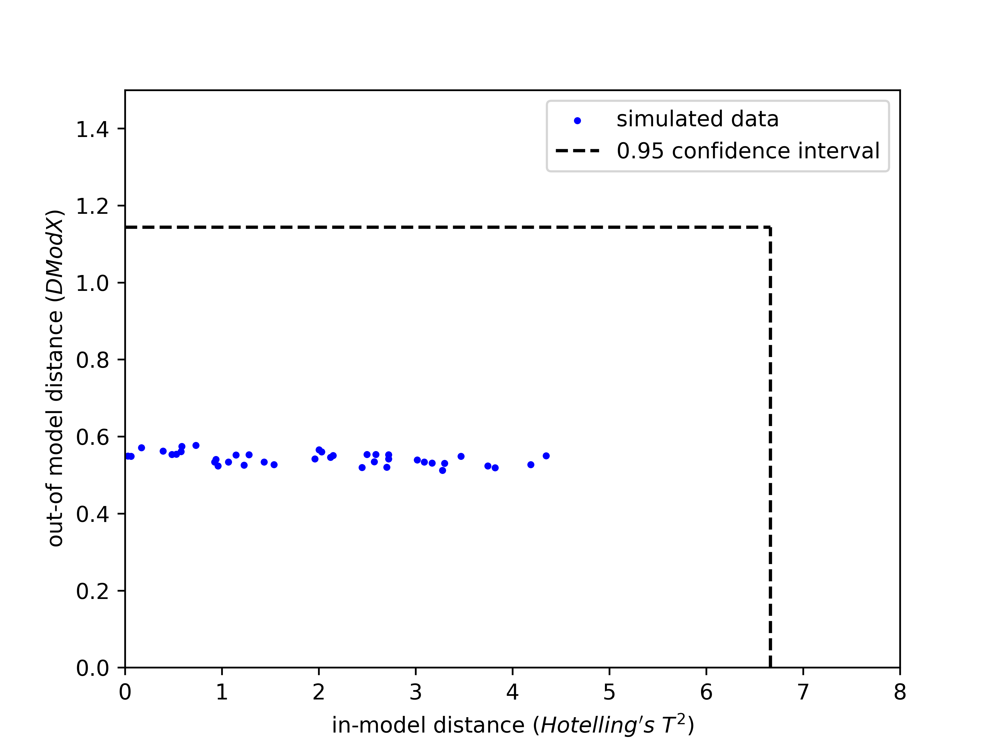
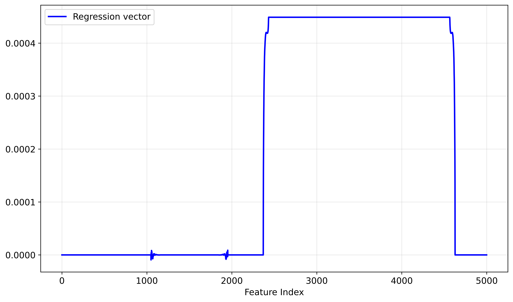

# Summary
`open_nipals` is a Python package that implements the Nonlinear Iterative Partial Least Squares (NIPALS) algorithm [@Geladi1986] for Partial Least Squares (PLS) regression as well as Principal Component Analysis (PCA). 
It employs the data transformation methods `fit()` and `transform()` from `scikit-learn` [@Pedregosa2011] and leverages Nelson's Single Component Projection (SCP) method for the imputation of missing data [@Nelson1996]. 
The NIPALS algorithm represents an alternative to the common Singular Value Decomposition (SVD) procedure for both PCA and PLS implemented in `scikit-learn` [@Pedregosa2011]. It is an iterative procedure that processes the data and internal matrices vector-wise and iteratively. When combined with SCP, NIPALS allows natural handling of missing data and setting tailored accuracy goals.

# Statement of Need
Python has emerged as a popular and comparatively simple programming environment for the development of machine learning and data science applications.
Packages like `numpy` for vector operations [@Harris2020], `pandas` for the handling of tabular data [@pandas2020], and `scikit-learn` (abbreviated `sklearn` in the following) for orthodox machine learning techniques like Random Forests, Support Vector Machines (SVM), and Principal Component Analyses (PCA) [@Pedregosa2011] promote Python's success in extracting patterns from big and complex data sets.
However, `sklearn` relies on Singular Value Decomposition (SVD) for its PCA and PLS classes, with negative effects on performance for applications like batch manufacturing and chemometrics, where missing data is common [@Nelson1996].
PCA and PLS models require unit scaled and mean centered input data, a feature that is nicely implemented in `sklearn`'s `StandardScaler` class.  
To this end, we felt the need to complement `sklearn` with an implementation of the NIPALS algorithm for PCA and PLS. 
As will be discussed in the benchmarking section below, the NIPALS algorithm has especially beneficial properties when it comes to peak memory consumption scaling and accuracy. 
Since it is an iterative algorithm, the runtime requirement can be balanced with the desired accuracy target.
In general, it is a favorable option at small number of latent variables (`n_components < 10`) and a high numerical accuracy requirement.

## Why a separate package?
We decided to wrap the implementation of NIPALS PCA and PLS into a separate package instead of extending `sklearn` by another model because:
1. `open_nipals`' usecase is very specific to batch manufacturing and chemometrics (cf. benchmarking section). `sklearn`'s audience is a broader Python machine learning community.
2. `open_nipals` follows a slightly different philosophy in that it integrates the missing value imputation into the proper package, and therefore does not align with `sklearn` in that particular aspect. Integrating the imputation of missing data into the analysis package comes with a performance advantage.
3. Keeping `open_nipals` and `sklearn` apart facilitates maintainability of both packages.

# Related Software
To our knowledge, the only other maintained open-source Python package that implements the NIPALS algorithm for PCA and PLS is Salvador García Muñoz' `pyphi` [@Garcia2019]. 
Our implementation is different in the following aspects:
1. `open_nipals` follows the template of `sklearn`, which allows:
   1. Integration with other `sklearn` modules, e.g. the `StandardScaler`
   2. Accumulation of multiple transformation steps into a `sklearn.pipeline`.
2. `open_nipals` uses Nelson's single component projection method [@Nelson1996] for score calculation in the face of missing values.
3. The utility class of `open_nipals` contains `ArrangeData`, another `sklearn` style data transformer object that ensures correct ordering and quantity of input columns.

# Functionality
Wherever possible, `open_nipals` follows and inherits structures from parent classes in `sklearn`. 
In principle, its functionality can be split into three parts: 
1. Utility functions for data preprocessing
2. Principal Component Analysis
3. Partial Least Squares regression. 

We decided to combine PCA and PLS functionality into one package, such that they can share common utility functions, e.g. -- but not limited to -- the `ArrangeData` class and matrix multiplication with missing values.

## Data Preprocessing, and Utility Functions
It is *strongly* encouraged to mean-center the input data for both PCA and PLS, and scale their variance to unity, e.g. with `sklearn`'s `StandardScaler`. 
However, the informed user should still have the chance to also apply `open_nipals` to non-standardized data. 
Therefore, we did not make standardization a part of `open_nipals`, unlike `sklearn.PCA`, which automatically mean-centers input data when not already done.
Moreover, the `ArrangeData` class of `open_nipals` ensures correct ordering of the input columns, as well as proper formatting.
A code example for preprocessing could therefore look like:
```python
from open_nipals.utils import ArrangeData
import pandas as pd
from sklearn.preprocessing import StandardScaler

# Load data
df = pd.read_csv('my_data.csv')

# Create objects
arrdat = ArrangeData()
scaler = StandardScaler()

# Fit and transform data using both objects
data = scaler.fit_transform(arrdat.fit_transform(df))
```

## PCA
Principal Component Analyses with `open_nipals` utilize a `NipalsPCA` transformer object, that can be fitted to and transform input data (and both at once), e.g. with:
```python
from open_nipals.nipalsPCA import NipalsPCA

model = NipalsPCA()
transformed_data = model.fit_transform(data)
```
The number of fitted components can be specified with the `n_components` argument in the constructor, which defaults to `n_components=2`. 
After having constructed the object, components can be added or subtracted using the `set_components()` function. 
Once fitted, components are stored so they do not have to be fitted again. 
This saves compute time should the developer decide to use lower number of components than are fitted and later move back to a higher number of principal components.

The following functions and attributes of the `sklearn` API are implemented by `NipalsPCA`:
- `fit(X)` to fit a new `NipalsPCA` model to a data set `X`
- `transform(X)` to transform a data set `X` according to a model previously fitted
- `fit_transform(X)` to do both above steps in one
- `inverse_transform(X)` to predict original data from transformed input data `X`
- `explained_variance_ratio_` to return the variance ratios explained by each component
  
Please note that the NIPALS algorithm does not compute eigenvalues of the covariance matrix, therefore computing them specifically for `explained_variance_` seemed unnatural. Thus, this attribute was not implemented.

The distance of a given data point from the average of the training data within the PCA model (in-model distance, IMD) can be calculated with `calc_imd()`, where $\mathrm{Hotelling's\, T^2}$ [@Hotelling1931] is implemented and could be extended to other IMD metrics (e.g. Mahalanobis Distance). 
Conversely, the out-of-model distance (OOMD, calculated by `calc_oomd()`) gives a measure of the distance to the model hyperplane. 
This is available as two metrics, `DModX` and `QRes` [@Eriksson1999]. 

Finally, the `calc_limit()` function calculates theoretical limits on both IMD and OOMD such that a specified fraction `alpha` of the data lies within these limits, assuming the data follows an f-distribution [@Brereton2016].

Following the data preparation scheme detailed in the benchmarking section, we simulated 1000 samples in a 40-dimensional data space, and trained a 4-component PCA model on it.
@autoref{fig:imd_oomd} shows the IMD-OOMD plot given this model and the theoretical limits calculated with it. 

{ width=70% }


## PLS
Beyond projecting input data onto a low-dimensional latent space, as PCA models do, PLS models can also predict dependent variables. 

Initializing a basic PLS model with a `NipalsPLS` object and transforming the input data accordingly looks like:
```python
from open_nipals.nipalsPLS import NipalsPLS

model = NipalsPLS()
transformed_x_data, transformed_y_data = model.fit_transform(data_x, data_y)
```
The following functions and attributes of the `sklearn` API are implemented by `NipalsPLS`:
- `fit(X)` to fit a new `NipalsPLS` model to data sets `X` and `y`
- `transform(X, y=None)` to transform a data set `X` according to a model previously fitted, with the option of adding a `y` data set 
- `fit_transform(X,y)` to do both above steps in one
- `inverse_transform(X)` to predict original data from transformed input data `X`
- `predict(X)` to predict dependent variables `y` given the model
- `explained_variance_ratio_` to return the `X` and `y` variance ratios explained by each component

As for `NipalsPCA`, `NipalsPLS` does not implement `explained_variance_` since the eigenvalues are not accessible as a byproduct of the NIPALS PLS algorithm

Beyond standard `sklearn` functionality, `NipalsPLS` implements `calc_oomd()` for the out-of-model distance with either `QRes` or `DModX` as implemented metrics, `calc_imd()` for the in-model distance, using the $\mathrm{Hotelling's\, T^2}$ metric. 
Summary statistics of PLS models can be displayed in similar plots to @autoref{fig:imd_oomd}.

`NipalsPLS` primarily differs from `NipalsPCA` by the inclusion of a `predict()` method to predict a y-matrix from an x-matrix with a previously fitted model, and the calculation of the regression vector with `get_reg_vector()`.
The latter serves as a measure for what input features the model considers predictive of the output, see @autoref{fig:reg_vect}.

{ width=70% }

## Debugging
If the maximum iteration counter is hit during the fitting procedure of new components of an `open_nipals` PCA or PLS model, a `max_iter Reached on LV {ind_LV}` warning is raised.
This indicates that the desired numerical tolerance for this component could not be achieved during the fit procedure.
Try to increase `max_iter`, or decrease `tol_criteria` if less numerical precision is still acceptable in your usecase.

Default values for both `NipalsPCA` and `NipalsPLS` are `max_iter = 10000` and `tol_criteria = 1e-6`. 
These defaults manifest a slightly higher emphasis on numerical accuracy than performance.

If the user observes any unexpected behavior by an `open_nipals` PCA or PLS models, it is recommended to enable the `verbose` flag in the `fit()` and `set_components()` methods.
This will print milestone markers during the fitting procedure.

# Benchmarking
In order to assess `open_nipals`' performance, we compared it to other common dimensionality reduction techniques with missing value imputation. 

Since the PCA and PLS implementations of `open_nipals` are very similar, and there are more alternative implementations of PCA than of PLS, we decided to stick to PCA for the benchmarking, expecting that observed trends translate to the performance of `open_nipals.NipalsPLS` module.

Our benchmark measures the respective runtime, peak memory consumption, and data reconstruction accuracy of the execution of the PCA model's `fit()` routine.
Runtime and peak memory allocation are measured by the Python-native `time` and `tracemalloc` packages. 
Data reconstruction accuracy is measured as the mean difference between the (synthetic) input data and the data reconstructed by the model using a `model.inverse_transform(model.transform(data))` logic.

The tested dimensionality reduction and imputation techniques are:
1. `open_nipals.NipalsPCA` with its native Nelson's Single Component Projection.
2. Adding components to an existing `open_nipals.NipalsPCA` model, leveraging the `set_components()` method. This is only evaluated for adding components given a fixed dataset.
3. `sklearn.PCA` with `sklearn.SimpleImputer` for univariate imputation of sparse input matrices.
4. `sklearn.PCA` with `sklearn.MatrixImputer` for multivariate imputation of sparse input matrices.
5. `sklearn.FactorAnalysis` Expectation Maximization (FA/EM) procedure, combined with `sklearn.SimpleImputer`.
6. `sklearn.FastICA` for Independent Component Analysis (ICA), combined with a `sklearn.SimpleImputer`.

Fit tolerances were set to `1e-4` for all methods, a maximum number of iterations was set to 1000 where applicable.
As mentioned before, one of the upsides of `open_nipals.NipalsPCA` compared to the SVD-based `sklearn.PCA` implementation is that numerical cost and accuracy can be traded off by setting tolerance criteria. 
We found these settings place `open_nipals.NipalsPCA` in the middle of the pack with regards to numerical cost, justifying the setting *a posteriori*.
Wherever necessary, we passed a globally initialized `numpy` random number generator into the model constructors or `fit` methods. 
Bear in mind that the NIPALS algorithm is a deterministic algorithm and therefore did not require any random state initialization.

## Dataset creation
A realistic synthetic dataset was created:
1. Construct an `M x M` random orthogonal matrix using the QR-decomposition, where `M` is the number of features of the dataset.
2. Construct a Gaussian `N x M` random matrix, with the number of samples `N`. Without loss of generality, decrease the variance of each of the `M` columns by a factor of 0.9 to mimic decreasing variance of the principal components.
3. Multiply the matrices built in the previous two steps.
4. Add Gaussian random noise with amplitude 0.1.
5. Standardize the resulting data matrix with an `sklearn.StandardScaler`.
6. Randomly mask 10% of the matrix entries with `np.nan`.

This procedure was repeated for any combination of number of samples and features plotted in the sections below.

## Parameter scaling of numerical cost and accuracy

{ width=100% }

Figure @autoref{fig:comb_comp} compares the performance of `open_nipals.NipalsPCA`, measured by runtime, memory requirements, and accuracy, for varying `n_components`, dimensionalities, and number of samples, to alternative dimensionality reduction and imputation techniques.
The data was varied around a center configuration of `n_components=4`, 100 samples, and 40 features. 
`FastICA` raised convergence warnings for `n_samples=100, n_features=40, n_components=4,8,16`, `n_samples=1000, n_features=40, n_components=4`, `n_samples=100, n_features=20, n_components=4`, `n_samples=100, n_features=100, n_components=4`.
We found the accuracy of the fitted ICA models to be comparable to the others, therefore decided to still use these datapoints. 
Excessive memory consumption of the experimental `MatrixImputer` made the computation of the point at `n_features=4`, 100 samples, and 1000 features numerically impossible. 
Therefore, this datapoint was omitted in the middle plot of the middle row in @autoref{fig:comb_comp}.

## Computational complexity and accuracy vs. number of latent variables
The leftmost column of @autoref{fig:comb_comp} shows complexity and accuracy evaluated over a range of 2 - 16 latent variables.

The upper left plot of @autoref{fig:comb_comp} shows the runtime cost of `open_nipals.NipalsPCA` increases with `n_components` at less-than exponential scaling, with ICA being by far the slowest option for `n_components>4`, FA/EM being the slowest option at `n_components<=4`, and `sklearn.PCA` the fastest option globally.
`sklearn.PCA` relies on SVD, therefore the numerical cost (runtime and memory) of inferring any number of latent variables is equal, which can be seen from the upper left and the middle left panel of @autoref{fig:comb_comp}. 
The two different imputer + `sklearn.PCA` combinations require precisely the same runtime at varying `n_components`, indicating that the runtime is dominated by the SVD, not the imputation.
Interestingly, fitting only additional components with `set_components()` has a minor effect on runtime at small `n_components`, and is even slower than fitting a new `open_nipals.NipalsPCA` model at `n_components=16`.

The peak memory consumption vs. `n_components` is plotted in the left plot of the middle row of @autoref{fig:comb_comp}. 
The comparison of `sklearn.PCA` paired with either `MatrixImputer` or `SimpleImputer` immediately suggests that the memory consumption is dominated by the imputation method rather than the actual PCA model fitting.
The memory consumption of `open_nipals.NipalsPCA` can be substantially reduced by adding components to an existing model with the `set_components` method, yielding the lowest memory consumption of all investigated methods at `n_components<16`.

This comes with very competitive accuracy of `open_nipals.NipalsPCA`, only mildly surpassed by the `MatrixImputation` + `sklearn.PCA` scenario. 
As expected, the choice of imputation method starts to matter at higher `n_components`, i.e. more predictive models.


## Computational complexity and accuracy vs. number of features
The middle column of @autoref{fig:comb_comp} shows the scaling of computational complexity and accuracy with the dimensionality of the data space (`n_features` 20 - 1000).
Since a new model has to be fit every time the dimensionality of the data space changes, there is no usecase for `set_components()`, which was consequently not displayed in the plots.

The upper middle panel of @autoref{fig:comb_comp} shows that `open_nipals.NipalsPCA`' model fitting has a high but competitive runtime, surpassed by FA/EM at small and ICA at 100 features, while being the slowest option at 1000 features. Its runtime in seconds vs. dimensionality curve is quite shallow (5e-2 - 2e-1), even compared to `sklearn.PCA` (5e-3 - 7e-2), which was faster than its competitors by 1-2 orders of magnitude throughout the investigated range of features.
However, `sklearn.PCA` shows a clear exponential scaling in runtime caused by the scaling of the numerical complexity of the SVD algorithm with the number of features (bear in mind that `sklearn.PCA` performs an SVD of the covariance matrix, which is a square matrix of the size of the number of features).

The memory consumption in MB vs. features is plotted in the middle row's middle plot of @autoref{fig:comb_comp}. 
It shows a competitive memory usage by `open_nipals.NipalsPCA`, particularly at >= 100 features. 
Memory usage at very small number of features (less than 100) seems to be dominated by overhead, of which `open_nipals.NipalsPCA` requires more than more orthodox algorithms like `sklearn.PCA` with univariate imputation. 
However, as the dimensionality increases, the overhead becomes less relevant, leading to `open_nipals.NipalsPCA`'s memory consumption curve being the shallowest (2e-1 - 3.5), compared to 8e-2MB - 2MB for `sklearn.PCA` with univariate imputation. 
The matrix imputation technique proves once more to require the most memory throughout the entire investigated range of dataspace dimensions by 1 - 2 orders of magnitude, leading to the data point at 1000 features being impossible to collect.

The accuracy is evaluated against different number of features in the lower middle panel of @autoref{fig:comb_comp}.
It proves `open_nipals.NipalsPCA` to be the most accurate technique, although the accuracies being very similar among the different methods.
All methods lose accuracy as the number of dimensions increases.

## Computational complexity and accuracy vs. number of samples
The rightmost column of @autoref{fig:comb_comp} displays computational complexity and accuracy over a broad range of dataset size (`n_samples` 50 - 10000).

The runtime requirement scaling with `n_samples` can be found in the upper right plot of @autoref{fig:comb_comp}. 
It shows competitive, but rather slow fit time by `open_nipals.NipalsPCA`, comparable to its competitors FA/EM and ICA.
Both imputation methods combined with `sklearn.PCA` are more than one order of magnitude faster and show very shallow profiles. 
The number of samples does not directly play a role in SVD-based PCA since the bottleneck is the computation of the eigenvalues of the `n_features x n_features` covariance matrix, thus the shallow `sklearn.PCA` runtime curves are expected.

As can be seen from the middle right panel of @autoref{fig:comb_comp}, the peak memory consumption of `open_nipals.NipalsPCA` follows exponential scaling with `n_samples` (@autoref{fig:comb_comp}), which is competitive with its alternatives.
The two `sklearn.PCA` scenarios form the edge cases, here. 
SVD-based PCA with univariate imputation consumes a bit less memory than ICA, FA/EM, and `open_nipals.NipalsPCA` at medium to large sample sizes, while SVD-based PCA with multivariate imputation consumes about one order of magnitude more memory than its competitors, although this gap closes with increasing sample size.

The numerical accuracy as a function of `n_samples` in @autoref{fig:comb_comp} remains quite constant, with `open_nipals.NipalsPCA` being slightly more accurate than all of its competitors throughout the entire range.

## Benchmarking conclusion
Compared to other standard dimensionality reduction methods, `open_nipals.NipalsPCA` convinces with highest accuracy, competitive memory consumption and runtime cost at low to medium `n_components`.
The algorithmic benchmark is amended by the possibility of freely trading numerical accuracy for numerical cost, and minimizing memory consumption through using `set_components()` to add new principal components to a pre-existing model.
This makes it particularly valuable and superior in settings with small- to medium-sized and -dimensional datasets, with low number of latent variables.

# Availability
`open_nipals` is available open-source under APACHE 2.0 license from this github repository [@on_github]. We appreciate your feedback and contributions.
The latest version is deployed to the Python Package Index [@on_pypi], the documentation was deployed to `readthedocs` [@on_readthedocs].
A jupyter [notebook](placeholder for git link) to reproduce @autoref{fig:imd_oomd}, another [notebook](placeholder for git link) to generate @autoref{fig:reg_vect}, and a [notebook](placeholder for git link) to generate @autoref{fig:comb_comp} can be found in [@on_github] under the `paper` branch.

# Acknowledgements
We acknowledge support by Johnson & Johnson Innovative Medicine. 
In particular, we would like to express our gratitude to Samuel Tung and Tyler Roussos 
of the Open Source Working Group (OSWG) within J&J, who helped driving the publication process of `open_nipals`.
Moreover, we acknowledge Calvin Ristad's contributions to v2.0 of the `open_nipals` code.

# References